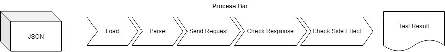

# 类层次结构
    BackBasicTestCase
        - BackPostCheckDBTC
            -- BackCreateTC
            -- BackUpdateTC
        - BackGetCheckBodyTC
            -- BackSearchTC

1. 第一层BackBasicTestcase引入fixture，为所有测试准备数据库基础
2. 第二层BackPostCheckDBTC和BackGetCheckBodyTC封装测试逻辑。
3. 第三层引入测试样例数据。

# 测试流程

# 这么做的原因
* 当测试逻辑需要修正或改进的时候，不需要更改任何测试样例。
* 测试样例显得非常简洁。
* 便于以后可能的自动生成测试样例。

# JSON规格
对于BackPostCheckDBTC和BackGetCheckBodyTC使用的JSON文件的规格将在这里介绍，这两个类分别使用被我称为pd(post and check database), gb(get and check body)格式的json文件。

## pd
总体为一个列表，每个列表项代表一个测试样例。每个测试样例是一个列表，其中每项的含义为：
1. 样例名，为字符串
2. url，为字符串
3. 模型名，为字符串
4. payload，为字典
5. 在回复中检查是否存在该字符串，为字符串，可选

示例：

    [
        "add_teacher_has_website",
        "/addTeacher/",
        "Teacher",
        {
            "name": "test_teacher_has_website",
            "title": "Only For Test",
            "website": "www.test.com"
        }
    ],
    [
        "add_course",
        "/addCourse/",
        "Course",
        {
            "name": "test_course",
            "website": "www.test.com",
            "courseID": "999",
            "description": "only for test",
            "courseType": "TESTER",
            "credit": 5
        },
        "test_course"
    ]

## gb
总体为一个列表，每个列表项代表一个测试样例。每个测试样例是一个列表，其中每项的含义为：
1. 样例名，为字符串
2. url，为字符串
3. payload，为字典
4. 回复中body中的retlist的长度，为整数
5. retlist中应含的项，为字典的列表，可选，无序比较

示例：

    [
        "search_teacher_assign",
        "/searchTeacher/",
        {
            "name": "qiang"
        },
        1,
        [
            {
                "name": "qiang",
                "website": "http://www.qiang.com",
                "title": "First Qiang"
            }
        ]
    ],
    [
        "search_teacher_any",
        "/searchTeacher/",
        {
            "name": ""
        },
        3
    ]