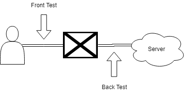

# 测试点

选择的测试点有两个
* 一个是用户与浏览器（客户端）之间的节点，也就是模拟用户对浏览器的操作与获取的响应来进行测试，称之为“前测试点”(Front Test Point)。
* 一个是浏览器（客户端）与服务器之间的节点，也就是模拟客户端来向服务器收发HTTP请求来进行测试，称之为“后测试点”(Back Test Point)。

我们没有在服务器内部设置测试点，也就是说我们将服务器视为一个黑盒。

# 测试工具
测试架构完全使用Django的django.test模块。

服务器端使用原生Django来搭建测试环境，即建立临时的测试用数据库、启动（或模拟）符合测试配置的服务器实例等。不过对于后测试点而言并不实际地启动一个服务器进程，而是直接调用模块。

客户端对两个测试点采用不同的工具来模拟。
* 对于前测试点，使用Selenium模拟客户端。
* 对于后测试点，使用Django原生的Client模拟客户端。

# 前测试点
## 设计模式
使用[Page Object](https://github.com/SeleniumHQ/selenium/wiki/PageObjects)作为Design Pattern。即，将每个页面作为一个类，将该页面提供的服务作为接口。每个类内部自己维护该页面的元素定位符。

## Maybe TODO
前端规格缺少页面内容的设计信息，我不确定这部分是否不需要严格规格确定。

## 页面类
A(B)意为A派生自B。若A中有方法和B一样，则意为重载覆盖。

### BasicPage
* GoHomePage: 点击首页按钮，跳转到首页。
* GoLoginPage: 点击登录按钮，跳转到登录页面。
* GoRegistPage: 点击注册按钮，跳转到注册页面。
* GoPersonPage: 点击个人信息按钮，跳转到个人信息页面。

### HomePage(BasicPage)
* GoHomePage: 无效。
* Search(s): 在搜索框中输入s，并跳转到搜索结果页面。

### LoginPage(BasicPage)
* GoLoginPage: 无效。

### RegistPage(BasicPage)
* GoRegistPage: 无效。

### GoPersonPage(BasicPage)
* GoPersonPage: 无效。

### SearchResultPage(BasicPage)
* GetResults: 返回搜索结果对应的DOM元素列表。
* GoDetailPage(i): 跳转到第i个搜索结果的课程信息界面。

### DetailPage(BasicPage)
* Searchxxx: 一族方法。点击某个课程信息的条项，然后跳转到搜索该条项的搜索结果页面。
* MakeComment: 点击发表评论按钮，跳转到评论页面。

### CommentPage(BasicPage)
* CommentDone: 点击提交按钮后，跳转回原来的课程信息页面。

## 测试思路
细的来说：
1. 检查用户需要知道的信息的元素是否出现在页面上。
5. 检查页面上是否出现了不该出现的元素。（例如已经登录的用户却在界面上找到了登录按钮）
2. 检查用户操作是否得到预期的响应。
3. 检查页面跳转逻辑是否如逾期执行。
4. 检查异常处理是否合理完善。

粗的来说：
1. 检查典型用户的一套操作流程是否能正常执行，并且用户是否能够的得到他们想要的信息。
2. 检查用户的异常操作是否会得到合理的报错，并能顺利恢复现场。

## 测试样例总览
此处不将列出详细的测试用例内容，只列出每族测试样例的概述。

* 内容检查
    * 搜索结果页面的课程信息是否与课程信息页面的课程信息一致。
    * 个人信息页面是否给出用户信息。
    * 课程信息页面是否给出评论信息。
    * TODO 缺乏页面内容规格信息。
* 页面跳转逻辑检查
    * 各页面的跳转逻辑是否与规格一致。
* 功能检查 & 鲁棒性检查
    * 登录功能
        * 是否能登录到一个已注册用户上
        * 是否不能登录到一个未注册用户上
        * 在登录信息不完整/错误的情况下能否给出有效提示引导用户完善信息
        * 在登陆后是否在各场景下都能正确反映登录用户信息
            * 评论后该评论的作者是否是登录用户
            * 个人信息页面是否是登录用户的信息。
            * TODO 缺乏页面内容规格信息
    * 注册功能
        * 是否不能注册一个已注册用户。
        * 是否能注册一个未注册用户。
        * 在注册信息不完整/错误的情况下能否给出有效提示引导用户完善信息
        * TODO 不清楚注册后是不是直接是登录状态
    * 评论功能
        * 是否能在对应课程下给出相应的评论
        * 在评论超字数的情况下能否给出有效提示引导用户。
        * TODO 缺乏页面内容规格信息
    * 搜索功能
        * 是否能通过课程信息页面的一些条项搜索对应的内容
        * 是否能搜索到确实存在的课程
        * 是否会搜索到不存在的课程
        * TODO 是否存在非法的搜索字符？
* 页面冗余检查
    * 在未登录情况下是否存在个人信息页面按钮。以及登录情况下是否存在登录、注册按钮。
    * TODO 缺乏页面内容规格信息
* 兼容性检查
    * 页面长宽比兼容性检查：在不同长宽比的浏览器界面下是否都能有良好响应
    * 浏览器兼容性检查：在不同浏览器中是否都能有良好响应
    * 分辨率兼容性检查
        * 不做这个

# 后测试点
## 前提
我们默认假设一切规格规定的渠道的用户输入都已在前端被充分测试鲁棒性，故在后端不做任何相关测试。

## 测试思路
1. 检查各接口是否如规格描述地正确响应。
2. 检查是否存在不该暴露给用户的资源也暴露了。
3. 使用代码覆盖率，检查是否存在无用代码。

## 测试样例总览
此处不将列出详细的测试用例内容，只列出每族测试样例的概述。

* 标准检查：对于非常良好的输入的情况下，各接口是否给出正确输出。
* 边界检查：对于满足传入需求，但处在边界的输入，各接口是否能给出正确输出。
    * TODO
* 安全性检查：通过手动输入url用户能否访问不该能够访问到的东西。
    * 在未登录情况下是否能访问个人信息，及已登录情况下能否访问其他用户的个人信息。
    * TODO 可能还有。
* 异常检查
    * 我们不做这个。
* 压力测试
    * 我们也不做这个。

## 测试样例构造思路
这里只将列出有点蛇足的测试样例的构造思路。

### 标准检查-同质合并
注意到有大量的接口都是Create, Update, Search这类对Model的操作，考虑它们的同质性。

观察可知同质性：
* Create, Update: 都是发送Post请求，并将修改的Model信息附加在payload上。收到回复后检查回复请求中的状态码来确定是否成功，最后检查数据库中是否有符合要求的Model被添加/更新。

* Search: 都是发送Get请求，并将期望的Model信息附加在payload上。收到回复后检查回复请求中的状态码来确定是否成功，最后检查回复请求中body的信息是否符合预期。

也就是说大多数的测试样例之间的区别仅仅在于
* 请求的url
* 请求的payload
* 检查的Model/Body内容

故而可以将这部分数据抽离出来单独存放，使用统一的逻辑进行测试。这部分工作在[test_auto_back.md](test_auto_back.md)中被进一步描述。

# Note-Mine：写给我自己的备注。
* 不知道为什么VSCode下调试Selenium代码的话会卡click，直接运行的话不会有这个问题。